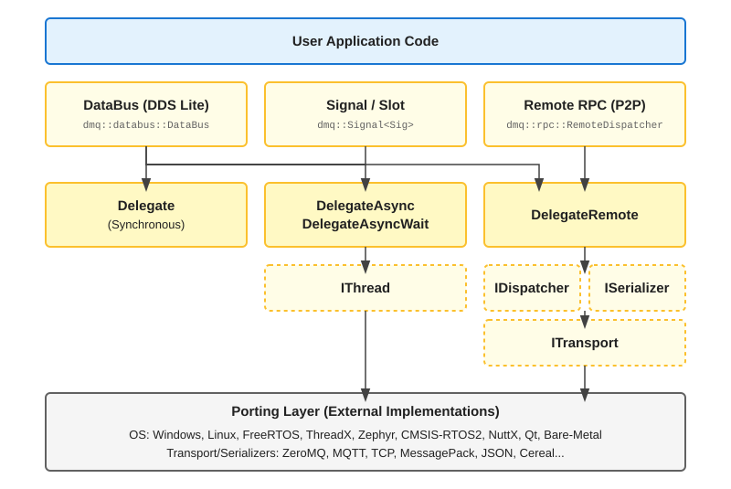

[](https://github.com/DelegateMQ/DelegateMQ/actions/workflows/cmake_ubuntu.yml)
[](https://github.com/DelegateMQ/DelegateMQ/actions/workflows/cmake_clang.yml)
[](https://github.com/DelegateMQ/DelegateMQ/actions/workflows/cmake_windows.yml)


# Delegates in C++

DelegateMQ is a modular C++ messaging library with a header-only core. It provides a unified, thread-safe API for invoking any callable (e.g., function, method, lambda) across different execution contexts:

* **Synchronous & Asynchronous:** Local thread-safe callbacks, blocking or fire-and-forget.
* **Signal / Slot:** Decoupled, multicast event handling with built-in async support.
* **DataBus (DDS Lite):** Topic-based publish/subscribe with thread-safe async data distribution.
* **Remote:** Inter-process (IPC) and inter-processor communication over any transport.

The library is unit-tested, built for portability (Windows, Linux, RTOS, bare metal), and lets you include only the features you need without unwanted overhead.

# Motivation

Applications typically use one mechanism for callbacks, another for inter-thread messaging, and a third for inter-processor communication — each with its own API and data-passing rules. Yet all three solve the same underlying problem: move argument data to a target function and invoke it.

DelegateMQ unifies them in a single library. Bind a delegate to any callable — free function, method, or lambda — and invoke it synchronously, on another thread, or on another processor. The library handles the copying, marshalling, and dispatch; the call site stays the same.

# Advantages

Why choose DelegateMQ over a callback, signal/slot, or messaging library.

| Advantage | Description |
| --- | --- |
| One invocation model | Sync, async, and remote calls share the same `dmq::MakeDelegate` syntax — promoting a local callback to async or remote is a one-line change. |
| Targeted thread dispatch | Handlers specify the thread they run on; the library queues and dispatches the call, so code always executes in the correct thread context. |
| Application owns every thread | The library creates no internal threads — scheduling, stack sizes, and watchdogs stay explicit and auditable. |
| Off-target development | Embedded application logic builds and runs on a Windows or Linux host for testing; moving to hardware swaps only the thread port and transport. |
| Location transparency | DataBus subscribers receive data identically whether the publisher is in the same thread, another process, or a remote processor. |

# Supported Integrations

Numerous platform, serialization, and transport integrations are available out of the box. Adding support for a new OS, serializer, or transport requires only implementing a small pure-virtual interface.

| Category | Supported |
| :--- | :--- |
| **Operating Systems** | Windows, Linux, FreeRTOS, ThreadX, Zephyr, CMSIS-RTOS2, Qt, Bare-metal |
| **Serialization** | [MessagePack](https://msgpack.org/index.html), [RapidJSON](https://github.com/Tencent/rapidjson), [Cereal](https://github.com/USCiLab/cereal), [Bitsery](https://github.com/fraillt/bitsery), [MessageSerialize](https://github.com/endurodave/MessageSerialize) |
| **Transport** | [ZeroMQ](https://zeromq.org/), [NNG](https://github.com/nanomsg/nng), [MQTT](https://github.com/eclipse-paho/paho.mqtt.c), [Serial Port](https://github.com/sigrokproject/libserialport), TCP, UDP, ARM LwIP, ThreadX NetX/Duo, Zephyr Networking, data pipe, memory buffer |

# Getting Started

[CMake](https://cmake.org/) is used to create the project build files on any Windows or Linux machine. DelegateMQ supports Visual Studio, GCC, Clang, and ARM toolchains.

## Quick Start

Clone and build the main delegate application. No third-party libraries needed.

```bash
git clone https://github.com/DelegateMQ/DelegateMQ.git
cd DelegateMQ
cmake -B build
cmake --build build
```

Run the built executable:

```bash
# Windows
build\delegate_app\Debug\delegate_app.exe

# Linux
./build/delegate_app/delegate_app
```

## Example Projects

See [Example Projects](docs/BUILD.md#example-ecosystem-sandbox) for stand-alone projects demonstrating core features like Signal/Slot and async delegates, remote communication (TCP, UDP, ZeroMQ, MQTT), and more.

# Overview

A delegate is a type-safe wrapper around any callable — function, method, or lambda — that can be stored and invoked later, in a different context or on a different thread. DelegateMQ builds everything on this one primitive: the same delegate that fires a local callback can also dispatch onto a worker thread or a remote processor.

The OS, transport, and serializer sit behind small pure-virtual interfaces, so underlying technologies swap without changing application logic:

<br>
*DelegateMQ Layer Diagram*

## Key Concepts

- `dmq::MakeDelegate` – Creates a delegate bound to any callable. 
- `dmq::os::Thread` – A cross-platform thread class. Passed to `dmq::MakeDelegate` to dispatch a call onto a specific worker thread.
- `dmq::Signal<Sig>` – Thread-safe multicast signal. `Connect()` returns a `dmq::ScopedConnection` that auto-disconnects on scope exit.
- `dmq::MulticastDelegateSafe` – Thread-safe delegate container for broadcast invocation without RAII connection management.

## Synchronous Delegates

Synchronous delegates invoke the target function anonymously within the current execution context. No external library or OS dependencies are required.

```cpp
#include "DelegateMQ.h"

size_t MsgOut(const std::string& msg)
{
    std::cout << "[" << std::this_thread::get_id() << "] " << msg << std::endl;
    return msg.size();
}

int main()
{
    // 1. Synchronous Invocation
    auto sync = dmq::MakeDelegate(&MsgOut);
    sync("Invoke MsgOut sync!");
    return 0;
}
```

## Asynchronous Delegates

Asynchronous delegates simplify multithreaded programming by allowing you to invoke functions across thread boundaries safely and effortlessly. The library automatically marshals all arguments—whether passed by value, pointer, or reference—ensuring thread safety without manual locking or complex queue management.

```cpp
dmq::os::Thread thread("WorkerThread");
thread.CreateThread();

// 1. Asynchronous Invocation (Non-blocking / Fire-and-forget)
auto async = dmq::MakeDelegate(&MsgOut, thread);
async("Invoke MsgOut async (non-blocking)!");

// 2. Asynchronous Invocation (Blocking / Wait for result)
auto asyncWait = dmq::MakeDelegate(&MsgOut, thread, dmq::WAIT_INFINITE);
size_t size = asyncWait("Invoke MsgOut async wait (blocking)!");

// 3. Asynchronous Invocation with Timeout
auto asyncWait1s = dmq::MakeDelegate(&MsgOut, thread, std::chrono::seconds(1));
auto retVal = asyncWait1s.AsyncInvoke("Invoke MsgOut async wait (blocking max 1s)!");
if (retVal.has_value())     // Async invoke completed within 1 second?
    size = retVal.value();  // Get return value
```

Multiple asynchronous delegates can also be stored in a `dmq::MulticastDelegateSafe` container and invoked as a group — a common pattern for completion callbacks, where each registered callback executes on its own target thread:

```cpp
// Asynchronous Callback Pattern (broadcast to all registered callbacks)
dmq::MulticastDelegateSafe<void(int)> onComplete;
onComplete += dmq::MakeDelegate([](int result) {
    // Callback executed on 'thread'
}, thread);
onComplete(123);
```


## Signal / Slot

`dmq::Signal<Sig>` is a thread-safe multicast signal. Emit it like a function call; each connected slot receives the call independently. DelegateMQ signals support both synchronous and asynchronous dispatch, meaning slots can be executed in the caller's context or automatically queued onto a target worker thread chosen at connect time. `Connect()` returns a `dmq::ScopedConnection` that auto-disconnects when it goes out of scope — no manual unsubscribe needed.

Declare the signal as a plain class member — no `shared_ptr` or heap allocation required:

```cpp
class Button
{
public:
    dmq::Signal<void(int buttonId)> OnPressed;  // plain member

    void Press(int id) { OnPressed(id); }       // emit to all connected slots
};
```

Connect a slot and store the `dmq::ScopedConnection` for automatic lifetime management:

```cpp
class UI
{
public:
    UI(Button& btn) : m_thread("UIThread")
    {
        m_thread.CreateThread();

        // Slot dispatched to m_thread on every Press()
        m_conn = btn.OnPressed.Connect(
            dmq::MakeDelegate(this, &UI::HandlePress, m_thread)
        );
    }
    // No explicit disconnect needed — m_conn disconnects when UI is destroyed

private:
    void HandlePress(int buttonId) { std::cout << "Button " << buttonId << "\n"; }

    dmq::os::Thread m_thread;
    dmq::ScopedConnection m_conn;
};

Button btn;
{
    UI ui(btn);
    btn.Press(1);   // UI::HandlePress queued on UIThread
}                   // ui destroyed -> m_conn disconnects
btn.Press(2);       // safe: no subscribers, nothing happens
```

# DataBus (DDS Lite)

`dmq::databus::DataBus` is a type-safe, topic-based publish/subscribe system (similar to a lightweight DDS or MQTT) built on DelegateMQ delegates. It works across local threads and remote network nodes alike. Each subscriber specifies the thread that receives its data, so delivery always lands in the correct thread context with no manual queuing or synchronization.

DataBus creates no internal threads and is small enough for embedded targets, unlike full DDS systems. Quality of Service (QoS) options such as Last Value Cache (LVC) deliver the most recent value to new subscribers immediately.

```cpp
#include "DelegateMQ.h"

// 1. Subscribe to a topic (dispatched to a worker thread)
auto conn = dmq::databus::DataBus::Subscribe<float>("sensor/temp", [](float value) {
    std::cout << "Received temp: " << value << std::endl;
}, &workerThread);

// 2. Publish data to the topic
dmq::databus::DataBus::Publish<float>("sensor/temp", 25.5f);

// 3. Optional: Enable Last Value Cache (LVC)
dmq::databus::QoS qos;
qos.lastValueCache = true;
auto conn2 = dmq::databus::DataBus::Subscribe<int>("status", [](int s) {
    // New subscribers get the last published value immediately
}, &workerThread, qos);
```

# Remote Delegates

Remote delegates send a function call across a process or network boundary. Both sides share a message ID; the receiver binds a member function to it, and the sender's invocation is serialized, transported, and executed remotely — just like a normal function call.

```cpp
constexpr dmq::DelegateRemoteId TEMPERATURE_ID = 1;

// --- Receiver process: bind a handler to the ID ---
dmq::RemoteChannel<void(float)> rx(transport, serializer);
rx.Bind(&logger, &DataLogger::OnTemperature, TEMPERATURE_ID);
dmq::RegisterEndpoint(TEMPERATURE_ID, rx.GetEndpoint());

// --- Sender process: invoke the channel to send ---
dmq::RemoteChannel<void(float)> tx(transport, serializer, TEMPERATURE_ID);
tx(25.5f);  // invoke; argument is serialized and sent to the receiver
```

Any transport (ZeroMQ, TCP, UDP, serial, ...) and serializer (MessagePack, Cereal, ...) can carry the call. See [Design Details](docs/DETAILS.md) for the complete pattern and [Example Projects](docs/BUILD.md#example-ecosystem-sandbox) for working programs with real transports.

# DelegateMQ Tools

DelegateMQ includes three diagnostic TUI (Terminal User Interface) consoles for real-time monitoring of DataBus traffic, network topology, and thread performance. Monitoring runs through an asynchronous bridge and never blocks the application. Built with FTXUI, the consoles run cross-platform in any terminal and support regex filtering for traffic analysis:

| Tool | Purpose |
|------|---------|
| **`dmq-spy`** | Real-time live feed of all DataBus messages — acts as a "Software Logic Analyzer" |
| **`dmq-monitor`** | Live network topology view — shows all active nodes, status, uptime, and published topics |
| **`dmq-thread`** | Performance dashboard — monitors thread health, queue depths, and dispatch latency (Avg/Max) |


# Features

DelegateMQ at a glance. 

| Category | DelegateMQ |
| --- | --- |
| Purpose | Unify callable invocation across threads, processes, and networks |
| Usages | Callbacks (synchronous and asynchronous), asynchronous API's, communication and data distribution, and more |
| Library | Allows customizing data sharing between threads, processes, or processors |
| Object Lifetime | Thread-safe management via smart pointers (`std::weak_ptr`) prevents async invocation on destroyed objects (no dangling pointers). |
| Complexity | Lightweight and extensible through external library interfaces and full source code |
| Threads | No internal threads. External configurable thread interface portable to any OS (`dmq::IThread`). |
| Watchdog | Configurable timeout to detect and handle unresponsive threads. |
| Signal and Slots | Standard Signal-Slot pattern (`dmq::Signal<Sig>`). `Connect()` returns a `dmq::ScopedConnection` for RAII auto-disconnect. Thread-safe by default; no `shared_ptr` required. |
| Multicast | Broadcast invoke anonymous callable targets onto multiple threads |
| DataBus | Topic-based middleware distribution system (DDS Lite) across threads or remote nodes |
| Interop | C#, Python, and others supported via a **Shared Native Core** architecture. See [Cross-Language Interop](docs/INTEROP.md). |
| Message Priority | Asynchronous delegates support prioritization to ensure timely execution of critical messages |
| Serialization | External configurable serialization data formats, such as MessagePack, RapidJSON, or custom encoding (`dmq::ISerializer`) |
| Transport | External configurable transport, such as ZeroMQ, TCP, UDP, serial, data pipe or any custom transport (`dmq::transport::ITransport`)  |
| Transport Reliability | Provided by the built-in reliability layer (`dmq::util::ReliableTransport`) or communication library (e.g. ZeroMQ, nng, TCP/IP stack). | |
| Message Buffering | Remote delegate message buffering provided by a communication library (e.g. ZeroMQ) or custom solution within transport |
| Dynamic Memory | Heap or DelegateMQ fixed-block allocator |
| Debug Logging | Debug logging using spdlog C++ logging library |
| Error Handling | Configurable for return error code, assert or exception |
| Embedded Friendly | Yes. Any OS such as Windows, Linux and FreeRTOS. An OS is not required (i.e. "super loop"). |
| Operating System | Any. Custom `dmq::IThread` implementation may be required. |
| Language | C++17 or higher |

# Documentation

| Guide | Description | Key Focus |
| :--- | :--- | :--- |
| [**Tutorial**](docs/TUTORIAL.md) | Step-by-step system evolution | Adoption & Use Cases |
| [**Build**](docs/BUILD.md) | Build & configuration guide | CMake & Setup |
| [**Signals**](docs/SIGNALS.md) | Decoupled event handling | Signal/Slot RAII |
| [**DataBus**](docs/DATABUS.md) | Topic-based pub/sub middleware | DDS Lite & Networking |
| [**Design Details**](docs/DETAILS.md) | Deep technical architecture | API Reference |
| [**Porting Guide**](docs/PORTING.md) | OS & Hardware abstraction | Platform Support |
| [**Interop**](docs/INTEROP.md) | Multi-language integration | C# & Python |
| [**Tools**](tools/TOOLS.md) | Diagnostic TUI dashboards | Spy & Monitor |
| [**Comparison**](docs/COMPARISON.md) | Middleware benchmarks | Tradeoff Analysis |

# Other Projects Using DelegateMQ

Repositories utilizing the DelegateMQ library.

| Project | Description |
| :--- | :--- |
| [Integration Test Framework](https://github.com/DelegateMQ/IntegrationTestFramework) | A multi-threaded C++ software integration test framework using Google Test and DelegateMQ libraries. |
| [Active-Object State Machine in C++](https://github.com/DelegateMQ/active-fsm) | A modern active-object C++ finite state machine providing RAII-safe asynchronous dispatch and pub/sub signals. |
| [Async-SQLite](https://github.com/DelegateMQ/Async-SQLite) | An asynchronous SQLite thread-safe wrapper implemented using an asynchronous delegate library. |
| [Async-DuckDB](https://github.com/DelegateMQ/Async-DuckDB) | An asynchronous DuckDB thread-safe wrapper implemented using an asynchronous delegate library. |
| [Async-HTTP](https://github.com/DelegateMQ/Async-HTTP) | An asynchronous HTTP thread-safe client wrapper implemented using an asynchronous delegate library. |
