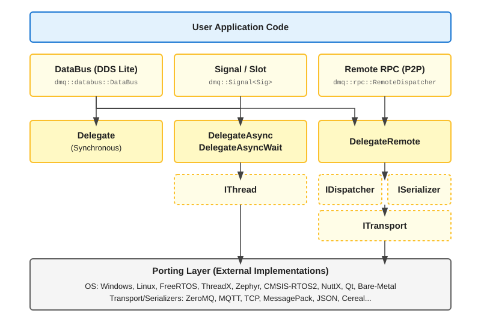

[](https://github.com/DelegateMQ/DelegateMQ/actions/workflows/cmake_ubuntu.yml)
[](https://github.com/DelegateMQ/DelegateMQ/actions/workflows/cmake_clang.yml)
[](https://github.com/DelegateMQ/DelegateMQ/actions/workflows/cmake_windows.yml)
[](https://github.com/DelegateMQ/DelegateMQ/actions/workflows/cmake_embedded.yml)
[](https://github.com/DelegateMQ/DelegateMQ/actions/workflows/cmake_sanitizers.yml)
[](https://github.com/DelegateMQ/DelegateMQ/actions/workflows/cmake_stress.yml)
[](https://github.com/DelegateMQ/DelegateMQ/actions/workflows/embedded_ports_compile.yml)


# Delegates in C++

DelegateMQ is a modular C++ messaging library with a header-only core. It provides a unified, thread-safe API for invoking any callable (e.g., function, method, lambda) across different execution contexts:

* **Synchronous & Asynchronous:** Local thread-safe callbacks, blocking or fire-and-forget.
* **Signal / Slot:** Decoupled, multicast event handling with built-in async support.
* **DataBus (DDS Lite):** Topic-based publish/subscribe with thread-safe async data distribution.
* **Remote:** Inter-process (IPC) and inter-processor communication over any transport.

The library is lightweight, unit-tested, and ships as full source code under the MIT license. It scales from PC applications down to small RTOS and bare-metal microcontrollers (Windows, Linux, RTOS, bare metal), and lets you include only the features you need without unwanted overhead.

# Motivation

Applications typically use one mechanism for callbacks, another for inter-thread messaging, and a third for inter-processor communication. Each brings its own API and data-passing rules, plus the hand-written queues, mutexes and message-packing code to go with it. Yet all three solve the same problem: move argument data to a target function and invoke it.

DelegateMQ unifies them in a single library. Bind a delegate to any callable (free function, method or lambda) and invoke it synchronously, on another thread, or on another processor. The library handles the copying, marshalling and dispatch; the calling code stays the same. The DataBus applies the same idea to data: publishers and subscribers don't need to know whether the other side is on the same thread or a different CPU.

# Library

DelegateMQ is layered: a header-only core, plus optional components you enable only if you need them.

| Component | Description |
| --- | --- |
| **Delegate Core** | Header-only. Synchronous delegates with no OS required, asynchronous delegates for cross-thread calls, and signals for async signalling. |
| **RPC** | Remote function calls between processes and processors, over any transport and serializer. |
| **DataBus** | Topic-based publish/subscribe across threads, processes and processors, with quality-of-service options. |

# Advantages

Why choose DelegateMQ over a callback, signal/slot, or messaging library.

| Advantage | Description |
| --- | --- |
| One invocation model | Sync, async, and remote calls share the same `dmq::MakeDelegate` syntax — promoting a local callback to async or remote is a one-line change. |
| Targeted thread dispatch | Handlers specify the thread they run on; the library queues and dispatches the call, so code always executes in the correct thread context. |
| Application owns every thread | The library creates no internal threads — scheduling, stack sizes, and watchdogs stay explicit and auditable. |
| Off-target development | Embedded application logic builds and runs on a Windows or Linux host for testing; moving to hardware swaps only the thread port and transport. |
| Location transparency | DataBus subscribers receive data identically whether the publisher is in the same thread, another process, or a remote processor. |
| Less application code | The library moves data to its destination — including across threads and processors — with type-safe delivery, eliminating hand-coded message queues, mutexes, and transport plumbing at the call and receive handler sites. |

# Supported Integrations

Numerous platform, serialization, transport, and tool integrations are available out of the box. Adding support for a new OS, serializer, or transport requires only implementing a small pure-virtual interface.

| Category | Supported |
| :--- | :--- |
| **Operating Systems** | Windows, Linux, POSIX, FreeRTOS, ThreadX, Zephyr, CMSIS-RTOS2, NuttX, Qt, Bare-metal |
| **Serialization** | [MessagePack](https://msgpack.org/index.html), [RapidJSON](https://github.com/Tencent/rapidjson), [Cereal](https://github.com/USCiLab/cereal), [Bitsery](https://github.com/fraillt/bitsery), [MessageSerialize](https://github.com/endurodave/MessageSerialize) |
| **Transport** | [ZeroMQ](https://zeromq.org/), [NNG](https://github.com/nanomsg/nng), [MQTT](https://github.com/eclipse-paho/paho.mqtt.c), [Serial Port](https://github.com/sigrokproject/libserialport), TCP, UDP, ARM LwIP, ThreadX NetX/Duo, Zephyr Networking, data pipe, memory buffer |
| **Bridges & Tools** | [MQTT gateway](tools/TOOLS.md#json-bridges--jsontopics-and-mqttbridge) (standard MQTT with JSON payloads, for MQTT tools such as [Node-RED](https://nodered.org/), [Home Assistant](https://www.home-assistant.io/) and [Grafana](https://grafana.com/)); [PlotJuggler](https://github.com/facontidavide/PlotJuggler) live plots; [Wireshark](https://www.wireshark.org/) dissector |

# Example Use Cases

- Async callback between a subsystem and the UI
- Data passed between threads using Signals
- Local and remote data distribution between threads and CPUs over Ethernet, serial, or both
- Embedded development on a PC, with the same code running on the target via OS and transport abstraction
- Blocking call into a worker thread with a timeout, returning its result
- Thread-safe wrapper around a non-thread-safe library (database, HTTP client, file system)
- Periodic tasks driven by timers, dispatched onto worker threads
- Watchdog detection of hung or starved threads
- Remote procedure calls between processes or processors
- C# or Python tools commanding and monitoring an embedded device
- Bridging device data to MQTT as JSON, for dashboards and IoT platforms
- On-target integration tests that call internal functions on their own threads

# Getting Started

[CMake](https://cmake.org/) is used to create the project build files on any Windows or Linux machine. DelegateMQ supports Visual Studio, GCC, Clang, and ARM toolchains.

## Quick Start

Clone and build the main delegate application. No third-party libraries needed.

```bash
git clone https://github.com/DelegateMQ/DelegateMQ.git
cd DelegateMQ
cmake -B build
cmake --build build
```

Run the built executable:

```bash
# Windows
build\delegate_app\Debug\delegate_app.exe

# Linux
./build/delegate_app/delegate_app
```

# Overview

A delegate is a type-safe wrapper around any callable — function, method, or lambda — that can be stored and invoked later, in a different context or on a different thread. DelegateMQ builds everything on this one primitive: the same delegate that fires a local callback can also dispatch onto a worker thread or a remote processor.

The OS, transport, and serializer sit behind small pure-virtual interfaces, so underlying technologies swap without changing application logic:

<br>
*DelegateMQ Layer Diagram*

## Key Concepts

- `dmq::MakeDelegate` – Creates a delegate bound to any callable. 
- `dmq::os::Thread` – A cross-platform thread class. Passed to `dmq::MakeDelegate` to dispatch a call onto a specific worker thread.
- `dmq::Signal<Sig>` – Thread-safe multicast signal. `Connect()` returns a `dmq::ScopedConnection` that auto-disconnects on scope exit.
- `dmq::MulticastDelegateSafe` – Thread-safe delegate container for broadcast invocation without RAII connection management.
- `dmq::util::Timer` – Periodic and one-shot timer. `OnExpired` is a `dmq::Signal`; all timers are driven by the application calling `Timer::ProcessTimers()`.
- `dmq::databus::DataBus` – Type-safe, topic-based publish/subscribe system built on delegates; works across local threads and remote network nodes alike.
- `dmq::rpc::RemoteDispatcher` – Owns the network thread, receive loop, and ACK/retry-status routing for point-to-point remote delegate invocation.

## Synchronous Delegates

Synchronous delegates invoke the target function anonymously within the current execution context. No external library or OS dependencies are required.

```cpp
#include "DelegateMQ.h"

size_t MsgOut(const std::string& msg)
{
    std::cout << "[" << std::this_thread::get_id() << "] " << msg << std::endl;
    return msg.size();
}

int main()
{
    // 1. Synchronous Invocation
    auto sync = dmq::MakeDelegate(&MsgOut);
    sync("Invoke MsgOut sync!");
    return 0;
}
```

## Asynchronous Delegates

Asynchronous delegates simplify multithreaded programming by allowing you to invoke functions across thread boundaries safely and effortlessly. The library automatically marshals all arguments—whether passed by value, pointer, or reference—ensuring thread safety without manual locking or complex queue management.

```cpp
dmq::os::Thread thread("WorkerThread");
thread.CreateThread();

// 1. Asynchronous Invocation (Non-blocking / Fire-and-forget)
auto async = dmq::MakeDelegate(&MsgOut, thread);
async("Invoke MsgOut async (non-blocking)!");

// 2. Asynchronous Invocation (Blocking / Wait for result)
auto asyncWait = dmq::MakeDelegate(&MsgOut, thread, dmq::WAIT_INFINITE);
size_t size = asyncWait("Invoke MsgOut async wait (blocking)!");

// 3. Asynchronous Invocation with Timeout
auto asyncWait1s = dmq::MakeDelegate(&MsgOut, thread, std::chrono::seconds(1));
auto retVal = asyncWait1s.AsyncInvoke("Invoke MsgOut async wait (blocking max 1s)!");
if (retVal.has_value())     // Async invoke completed within 1 second?
    size = retVal.value();  // Get return value
```

Multiple asynchronous delegates can also be stored in a `dmq::MulticastDelegateSafe` container and invoked as a group — a common pattern for completion callbacks, where each registered callback executes on its own target thread:

```cpp
// Asynchronous Callback Pattern (broadcast to all registered callbacks)
dmq::MulticastDelegateSafe<void(int)> onComplete;
onComplete += dmq::MakeDelegate([](int result) {
    // Callback executed on 'thread'
}, thread);
onComplete(123);
```

`dmq::util::AsyncInvoke` reduces a blocking cross-thread call to one line. A common use is making a class thread-safe: each public method marshals its call onto the class's own thread. If the caller is already on that thread, the function runs directly, so there's no self-deadlock:

```cpp
class Database
{
public:
    Database() : m_thread("DbThread") { m_thread.CreateThread(); }

    // Callable from any thread; InternalWrite() always runs on m_thread
    bool Write(const std::string& key, int value) {
        return dmq::util::AsyncInvoke(this, &Database::InternalWrite, m_thread,
                                      dmq::WAIT_INFINITE, key, value);
    }

private:
    bool InternalWrite(const std::string& key, int value);  // no locks needed

    dmq::os::Thread m_thread;
};
```

## Threads

`dmq::os::Thread` is the worker thread that asynchronous delegates dispatch onto. The same class is available on every supported OS (stdlib, Win32, POSIX, FreeRTOS, ThreadX, Zephyr, CMSIS-RTOS2, NuttX, Qt), so application code doesn't change between ports. Each thread owns a message queue; high-priority messages (`dmq::Priority::HIGH`) are dispatched ahead of normal ones.

A thread can bound its queue and choose what happens when it fills (`dmq::FullPolicy`), enable a watchdog, run code on the worker at start, exit and idle, and choose how shutdown treats queued messages (`dmq::ExitPolicy`):

```cpp
// Queue limited to 50 messages; when full, drop new messages instead of faulting
dmq::os::Thread worker("Worker", /*maxQueueSize=*/50, dmq::FullPolicy::DROP);

worker.SetStartHandler(dmq::MakeDelegate([] { /* per-thread setup */ }));
worker.SetDroppedHandler(dmq::MakeDelegate([](size_t depth) { /* report the drop */ }));

worker.CreateThread(std::chrono::seconds(2));   // optional watchdog: fault if the thread stalls > 2 s

// ...

worker.ExitThread();                            // runs queued messages first (ExitPolicy::DRAIN)
// worker.ExitThread(dmq::ExitPolicy::DISCARD); // or discard them for a fast shutdown
```

| Policy | Options |
| --- | --- |
| `dmq::FullPolicy` (queue full) | `FAULT` (default) — fault immediately; `DROP` — discard the message; `TIMEOUT` — wait for space, then drop |
| `dmq::ExitPolicy` (`ExitThread()`) | `DRAIN` (default) — run every queued message, then exit; `DISCARD` — finish the running message, cancel the rest |

## Signal / Slot

`dmq::Signal<Sig>` is a thread-safe multicast signal. Emit it like a function call; each connected slot receives the call independently. DelegateMQ signals support both synchronous and asynchronous dispatch, meaning slots can be executed in the caller's context or automatically queued onto a target worker thread chosen at connect time. `Connect()` returns a `dmq::ScopedConnection` that auto-disconnects when it goes out of scope — no manual unsubscribe needed.

Declare the signal as a plain class member — no `shared_ptr` or heap allocation required:

```cpp
class Button
{
public:
    dmq::Signal<void(int buttonId)> OnPressed;  // plain member

    void Press(int id) { OnPressed(id); }       // emit to all connected slots
};
```

Connect a slot and store the `dmq::ScopedConnection` for automatic lifetime management:

```cpp
class UI
{
public:
    UI(Button& btn) : m_thread("UIThread")
    {
        m_thread.CreateThread();

        // Slot dispatched to m_thread on every Press()
        m_conn = btn.OnPressed.Connect(
            dmq::MakeDelegate(this, &UI::HandlePress, m_thread)
        );
    }
    // No explicit disconnect needed — m_conn disconnects when UI is destroyed

private:
    void HandlePress(int buttonId) { std::cout << "Button " << buttonId << "\n"; }

    dmq::os::Thread m_thread;
    dmq::ScopedConnection m_conn;
};

Button btn;
{
    UI ui(btn);
    btn.Press(1);   // UI::HandlePress queued on UIThread
}                   // ui destroyed -> m_conn disconnects
btn.Press(2);       // safe: no subscribers, nothing happens
```

## Timers

`dmq::util::Timer` provides periodic and one-shot callbacks. `OnExpired` is a `dmq::Signal`, so a slot connects the same way as above and can be dispatched onto any worker thread. 

```cpp
dmq::util::Timer heartbeat;

// Timer callback dispatched to 'thread' on every expiration
auto conn = heartbeat.OnExpired.Connect(
    dmq::MakeDelegate([]() { std::cout << "Heartbeat\n"; }, thread)
);

heartbeat.Start(std::chrono::milliseconds(1000));          // periodic
// heartbeat.Start(std::chrono::milliseconds(500), true);  // one-shot

// Drive all timers (e.g. main loop, RTOS task, or SysTick ISR)
while (running) {
    dmq::util::Timer::ProcessTimers();
    std::this_thread::sleep_for(std::chrono::milliseconds(10));
}

heartbeat.Stop();
```

## Fixed-Block Allocator (Optional)

Build with `DMQ_ALLOCATOR` to route all library allocations through a fixed-block pool instead of the heap. This gives deterministic allocation times and no heap fragmentation. Application code can use the same allocator through `dmq::` aliases. Without `DMQ_ALLOCATOR` they fall back to their `std::` equivalents, so the same source builds either way:

```cpp
class SensorMsg
{
    XALLOCATOR   // new/delete use the fixed-block pool
public:
    float value;
};

dmq::xlist<int> readings;                          // std::list with pool allocator
dmq::xmap<int, dmq::xstring> names;                // std::map, std::string equivalents
auto msg = dmq::xmake_shared<SensorMsg>();         // object and control block from the pool
```

`dmq::xset`, `dmq::xqueue`, `dmq::xstringstream`, and others are also available. See [Fixed-Block Memory Allocator](docs/DETAILS.md#fixed-block-memory-allocator).

# DataBus (DDS Lite)

`dmq::databus::DataBus` is a type-safe, topic-based publish/subscribe system (similar to a lightweight DDS or MQTT) built on DelegateMQ delegates. It works across local threads and remote network nodes alike. Each subscriber specifies the thread that receives its data, so delivery always lands in the correct thread context with no manual queuing or synchronization.

DataBus creates no internal threads and is small enough for embedded targets, unlike full DDS systems. Quality of Service (QoS) options such as Last Value Cache (LVC) deliver the most recent value to new subscribers immediately.

```cpp
#include "DelegateMQ.h"

// 1. Subscribe to a topic (dispatched to a worker thread)
auto conn = dmq::databus::DataBus::Subscribe<float>("sensor/temp", [](float value) {
    std::cout << "Received temp: " << value << std::endl;
}, &workerThread);

// 2. Publish data to the topic
dmq::databus::DataBus::Publish<float>("sensor/temp", 25.5f);

// 3. Optional: Enable Last Value Cache (LVC)
dmq::databus::QoS qos;
qos.lastValueCache = true;
auto conn2 = dmq::databus::DataBus::Subscribe<int>("status", [](int s) {
    // New subscribers get the last published value immediately
}, &workerThread, qos);
```

# Remote Delegates

Remote delegates send a function call across a process or network boundary. Both sides share a message ID; the receiver binds a handler function to it, and the sender's invocation is serialized, transported, and executed remotely — just like a normal function call.

```cpp
constexpr dmq::DelegateRemoteId TEMPERATURE_ID = 1;

void OnTemperature(float t) { std::cout << "Temp: " << t << "\n"; }

// --- Receiver process: bind a handler to the ID ---
dmq::RemoteChannel<void(float)> rx(transport, serializer);
rx.Bind(OnTemperature, TEMPERATURE_ID);
dispatcher.RegisterEndpoint(TEMPERATURE_ID, rx.GetEndpoint());  // dispatcher: dmq::rpc::RemoteDispatcher, see below

// --- Sender process: invoke the channel to send ---
dmq::RemoteChannel<void(float)> tx(transport, serializer, TEMPERATURE_ID);
tx(25.5f);  // invoke; argument is serialized and sent to the receiver
```

Any transport (ZeroMQ, TCP, UDP, serial, ...) and serializer (MessagePack, Cereal, ...) can carry the call. See [Design Details](docs/DETAILS.md) for the complete pattern and [Example Projects](docs/BUILD.md#example-ecosystem-sandbox) for working programs with real transports.

## Remote Dispatcher

`RemoteChannel` is the wire-level primitive above; `dmq::rpc::RemoteDispatcher` is what an application actually holds to use it. It owns the network thread, the receive loop, and ACK/retry-status routing, and hands `RemoteChannel` the transport it needs:

```cpp
class NetworkMgr
{
public:
    dmq::Signal<void(float)> OnTemperature;  // clients Connect() to this

    int Create() {
        m_dispatcher.Attach(m_transport, m_transport);
        m_rxChannel.emplace(m_transport, m_serializer);
        m_rxChannel->Bind(this, &NetworkMgr::ForwardTemperature, TEMPERATURE_ID);
        m_dispatcher.RegisterEndpoint(TEMPERATURE_ID, m_rxChannel->GetEndpoint());
        return 0;
    }
    void Start() { m_dispatcher.Start(); }
    void Stop()  { m_dispatcher.Stop(); }

private:
    void ForwardTemperature(float t) { OnTemperature(t); }

    dmq::rpc::RemoteDispatcher m_dispatcher;
    dmq::transport::ZeroMqTransport m_transport;  // could be any dmq::transport::ITransport (TCP, UDP, serial, ...)
    dmq::serialization::serializer::Serializer<void(float)> m_serializer;
    std::optional<dmq::RemoteChannel<void(float)>> m_rxChannel;
};
```

# Error Handling

DelegateMQ separates **hard faults** (programming or capacity errors that must stop the system) from **recoverable errors** (runtime conditions the application can handle and continue).

**Hard faults** — out of memory, a full thread queue under `FullPolicy::FAULT`, a watchdog timeout, or an invalid argument. The build selects how they surface:

| Build | Behavior |
| --- | --- |
| Default (desktop) | C++ exceptions: `std::bad_alloc`, `std::invalid_argument`, `std::runtime_error` |
| `DMQ_ASSERTS` (embedded default; automatic when exceptions are disabled) | `dmq::util::FaultHandler()` is called. Customize `port/fault/Fault.cpp` to log, capture a crash dump, or reset the system. |

**Recoverable errors** — serialization failures, dispatch failures and transport receive errors are reported as a `dmq::DelegateError` code through a handler or signal. A remote error with no handler registered escalates to a hard fault, so always register one:

```cpp
// Per remote channel
channel.SetErrorHandler(dmq::MakeDelegate(
    [](dmq::DelegateRemoteId id, dmq::DelegateError err, dmq::DelegateErrorAux aux) {
        std::cerr << "Remote " << id << " error " << (int)err << "\n";
    }));

// All channels registered with a RemoteDispatcher
auto errConn = dispatcher.OnError.Connect(dmq::MakeDelegate(
    [](dmq::DelegateRemoteId id, dmq::DelegateError err, dmq::DelegateErrorAux aux) { /* ... */ }));

// DataBus-wide (type mismatches, serializer errors, capacity limits)
auto busConn = dmq::databus::DataBus::SubscribeError(
    [](const dmq::xstring& topic, dmq::DelegateError err) { /* ... */ });
```

# DelegateMQ Tools

DelegateMQ includes three diagnostic TUI (Terminal User Interface) consoles for real-time monitoring of DataBus traffic, network topology, and thread performance. Monitoring runs through an asynchronous bridge and never blocks the application. Built with FTXUI, the consoles run cross-platform in any terminal and support topic filtering for traffic analysis:

| Tool | Purpose |
|------|---------|
| **`dmq-spy`** | Real-time live feed of all DataBus messages — acts as a "Software Logic Analyzer" |
| **`dmq-monitor`** | Live network topology view — shows all active nodes, status, uptime, and published topics |
| **`dmq-thread`** | Performance dashboard — monitors thread health, queue depths, and dispatch latency (Avg/Max) |

The tools also integrate with two popular third-party analyzers:

| Integration | Purpose |
|-------------|---------|
| **Wireshark** | A Lua dissector plugin (`tools/wireshark/dmq.lua`) decodes DelegateMQ UDP/TCP traffic in [Wireshark](https://www.wireshark.org/): header fields, ACKs, and per-project topic labels, with Wireshark's filters and statistics |
| **PlotJuggler** | `dmq-spy --plotjuggler` streams numeric DataBus values to [PlotJuggler](https://github.com/facontidavide/PlotJuggler) for live time-series plots |

See [Tools](tools/TOOLS.md) for setup and usage.


# Features

DelegateMQ at a glance. 

| Category | DelegateMQ |
| --- | --- |
| Purpose | Unify callable invocation across threads, processes, and networks |
| Usages | Callbacks (synchronous and asynchronous), asynchronous API's, communication and data distribution, and more |
| Library | Allows customizing data sharing between threads, processes, or processors |
| Object Lifetime | Thread-safe management via smart pointers (`std::weak_ptr`) prevents async invocation on destroyed objects (no dangling pointers). |
| Complexity | Lightweight and extensible through external library interfaces and full source code |
| Threads | No internal threads. External configurable thread interface portable to any OS (`dmq::IThread`). |
| Timers | Periodic and one-shot timers (`dmq::util::Timer`). Callbacks dispatch to any thread via `OnExpired` signal. No internal timer thread; driven by application calling `Timer::ProcessTimers()` from a loop, task, or ISR. |
| Watchdog | Configurable timeout to detect and handle unresponsive threads. |
| Signal and Slots | Standard Signal-Slot pattern (`dmq::Signal<Sig>`). `Connect()` returns a `dmq::ScopedConnection` for RAII auto-disconnect. Thread-safe by default; no `shared_ptr` required. |
| Multicast | Broadcast invoke anonymous callable targets onto multiple threads |
| DataBus | Topic-based middleware distribution system (DDS Lite) across threads or remote nodes |
| Interop | C#, Python, and others supported via a **Shared Native Core** architecture. See [Cross-Language Interop](docs/INTEROP.md). |
| Message Priority | Asynchronous delegates support prioritization to ensure timely execution of critical messages |
| Serialization | External configurable serialization data formats, such as MessagePack, RapidJSON, or custom encoding (`dmq::ISerializer`) |
| Transport | External configurable transport, such as ZeroMQ, TCP, UDP, serial, data pipe or any custom transport (`dmq::transport::ITransport`)  |
| Transport Reliability | Provided by the built-in reliability layer (`dmq::util::ReliableTransport`) or communication library (e.g. ZeroMQ, nng, TCP/IP stack). |
| Message Buffering | Remote delegate message buffering provided by a communication library (e.g. ZeroMQ) or custom solution within transport |
| Dynamic Memory | Heap or optional fixed-block allocator (`DMQ_ALLOCATOR`). Application code can use the same pool through `XALLOCATOR`, `dmq::xlist`, `dmq::xmap`, `dmq::xstring`, `dmq::xmake_shared`, and more; these fall back to `std::` equivalents when the allocator is disabled. |
| Debug Logging | Debug logging using spdlog C++ logging library |
| Error Handling | Hard faults use asserts (`DMQ_ASSERTS`, routed to a fault handler) or C++ exceptions, selected at build time. Recoverable errors (serialization failure, dispatch timeout) are reported to the application through `dmq::DelegateError` error handlers. |
| Embedded Friendly | Yes. Any OS such as Windows, Linux and FreeRTOS. An OS is not required (i.e. "super loop"). |
| Operating System | Any. Custom `dmq::IThread` implementation may be required. |
| Language | C++17 or higher |

# Documentation

| Guide | Description | Key Focus |
| :--- | :--- | :--- |
| [**Tutorial**](docs/TUTORIAL.md) | Step-by-step system evolution | Adoption & Use Cases |
| [**Build**](docs/BUILD.md) | Build & configuration guide | CMake & Setup |
| [**Signals**](docs/SIGNALS.md) | Decoupled event handling | Signal/Slot RAII |
| [**DataBus**](docs/DATABUS.md) | Topic-based pub/sub middleware | DDS Lite & Networking |
| [**Design Details**](docs/DETAILS.md) | Deep technical architecture | API Reference |
| [**Porting Guide**](docs/PORTING.md) | OS & Hardware abstraction | Platform Support |
| [**Interop**](docs/INTEROP.md) | Multi-language integration | C# & Python |
| [**Tools**](tools/TOOLS.md) | Diagnostic TUI dashboards and integrations | Spy, Monitor, Wireshark, PlotJuggler |
| [**Comparison**](docs/COMPARISON.md) | Middleware benchmarks | Tradeoff Analysis |
| [**Safety Notes**](docs/SAFETY.md) | Informational MISRA-style self-assessment | Not a certified/compliant standard |

# Example Projects

The [`example`](example/README.md) directory ranges from single-file snippets to complete multi-node applications. Highlights:

| Example | Description | Docs |
| :--- | :--- | :--- |
| **Sample projects** | Standalone CMake projects, each focused on one platform, RTOS port, or transport/serializer pairing: bare metal, FreeRTOS, ThreadX, Zephyr, NuttX, ZeroMQ, NNG, MQTT, UDP/TCP, serial. Most need third-party libraries; the [example workspace setup](docs/BUILD.md#example-ecosystem-sandbox) fetches and builds them. | [README.md](example/sample-projects/README.md) |
| **Cellutron** | Simulated safety-critical cell processing instrument: GUI, controller and safety nodes as three Windows/Linux processes, the controller and safety nodes on FreeRTOS or ThreadX simulators, linked by a distributed DataBus. | [CELLUTRON.md](example/cellutron/CELLUTRON.md) |
| **Pumptron** | Pump controller on a real STM32F4 Discovery board (FreeRTOS), monitored and commanded from a Windows/Linux console over a serial link using the DataBus. Includes a hardware watchdog and crash dumps delivered to the console. The same controller code also runs on the PC via the FreeRTOS simulator. | [PUMPTRON.md](example/pumptron/PUMPTRON.md) |

# Other Projects Using DelegateMQ

Repositories utilizing the DelegateMQ library.

| Project | Description |
| :--- | :--- |
| [Integration Test Framework](https://github.com/DelegateMQ/IntegrationTestFramework) | A multi-threaded C++ software integration test framework using Google Test and DelegateMQ libraries. |
| [Active-Object State Machine in C++](https://github.com/DelegateMQ/active-fsm) | A modern active-object C++ finite state machine providing RAII-safe asynchronous dispatch and pub/sub signals. |
| [Device Params in C++](https://github.com/DelegateMQ/device-params) | Typed device parameters for embedded C++ with range checks, change notification, power-loss-safe persistence (flash, file, SQLite) and remote get/set. |
| [Async-SQLite](https://github.com/DelegateMQ/Async-SQLite) | An asynchronous SQLite thread-safe wrapper implemented using an asynchronous delegate library. |
| [Async-DuckDB](https://github.com/DelegateMQ/Async-DuckDB) | An asynchronous DuckDB thread-safe wrapper implemented using an asynchronous delegate library. |
| [Async-HTTP](https://github.com/DelegateMQ/Async-HTTP) | An asynchronous HTTP thread-safe client wrapper implemented using an asynchronous delegate library. |
