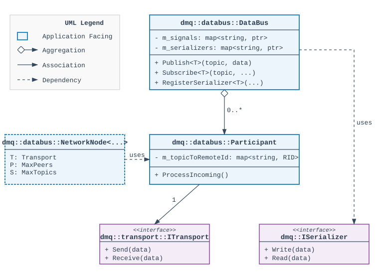

# DataBus

`dmq::databus::DataBus` is a high-level middleware built on top of DelegateMQ's core delegates. It provides a topic-based data distribution system (DDS Lite) that works across threads and remote nodes with full location transparency.

## Table of Contents

- [DataBus](#databus)
  - [Table of Contents](#table-of-contents)
  - [Quick Start](#quick-start)
  - [Core Concepts](#core-concepts)
  - [System Architecture](#system-architecture)
    - [High-Level View](#high-level-view)
  - [System Initialization](#system-initialization)
    - [1. Threading (for Async Subscribers)](#1-threading-for-async-subscribers)
    - [2. Timer Loop (for QoS Features)](#2-timer-loop-for-qos-features)
    - [3. Remote Node Polling (for Remote Distribution)](#3-remote-node-polling-for-remote-distribution)
    - [4. Memory Allocator (Optional)](#4-memory-allocator-optional)
  - [System Architecture](#system-architecture-1)
    - [DataBus (`dmq::databus::DataBus`)](#databus-dmqdatabusdatabus)
    - [Participant (`dmq::databus::Participant`)](#participant-dmqdatabusparticipant)
    - [Transport (`dmq::transport::ITransport`)](#transport-dmqtransportitransport)
    - [NetworkNode (`dmq::databus::NetworkNode`)](#networknode-dmqdatabusnetworknode)
  - [Internal Data Flow](#internal-data-flow)
  - [Remote Integration](#remote-integration)
    - [Setup Checklist](#setup-checklist)
    - [Relay Loop Hazard](#relay-loop-hazard)
  - [Topologies](#topologies)
  - [Error & Status Reporting](#error--status-reporting)
    - [Errors — DataBus::SubscribeError](#errors--databussubscribeerror)
    - [Status — NetworkNode signals](#status--networknode-signals)
  - [Design Philosophy](#design-philosophy)
  - [Pub/Sub vs. RPC](#pubsub-vs-rpc)
  - [Features](#features)
  - [Threading and Performance](#threading-and-performance)
  - [Quality of Service (QoS)](#quality-of-service-qos)
  - [Ordering and Guarantees](#ordering-and-guarantees)
  - [Examples](#examples)
    - [Local Pub/Sub](#local-pubsub)
    - [Async Dispatch (Thread)](#async-dispatch-thread)
    - [Remote Distribution](#remote-distribution)
    - [Advanced: Cellutron System](#advanced-cellutron-system)

## Quick Start

Three steps to send data between components:

**1. Define a message type**
```cpp
struct TemperatureMsg : public serialize::I {
    float celsius = 0.0f;
    std::ostream& write(serialize& ms, std::ostream& os) override { return ms.write(os, celsius); }
    std::istream& read (serialize& ms, std::istream& is) override { return ms.read (is, celsius); }
};
```

**2. Subscribe**
```cpp
auto conn = dmq::databus::DataBus::Subscribe<TemperatureMsg>(
    "sensor/temperature",
    [](const TemperatureMsg& msg) { printf("Temp: %.1f C\n", msg.celsius); });
```

**3. Publish**
```cpp
TemperatureMsg msg{36.6f};
dmq::databus::DataBus::Publish("sensor/temperature", msg);
```

> **Note:** `Subscribe` returns a `dmq::ScopedConnection`. You must store this object (e.g., as a class member); if it goes out of scope, the subscription is automatically removed.
>
> **Setup Note:** This quick start assumes the DelegateMQ infrastructure (threads, timers, etc.) is already running. See [System Initialization](#system-initialization) for details.

## Core Concepts

- **Topic**: A unique string identifier for a data stream (e.g., `"sensor/battery_voltage"`).
- **Participant**: A bridge to a remote node. Manages topic mappings and transport integration.
- **QoS (Quality of Service)**: Per-subscription configuration (e.g., Last Value Cache, rate limiting).
- **Data Model**: Each topic carries one typed value `void(T)`.

## System Architecture

### High-Level View

The diagram below illustrates the relationship between the `DataBus`, its local subscribers, and remote participants.



## System Initialization

Before using the `DataBus`, the underlying DelegateMQ infrastructure must be initialized.

### 1. Threading (for Async Subscribers)
If you use `Subscribe` with a thread argument, that thread must be created and running.
```cpp
dmq::os::Thread workerThread("Worker");
workerThread.CreateThread();
// ...
DataBus::Subscribe<float>("topic", handler, &workerThread);
```

### 2. Timer Loop (for QoS Features)
Quality of Service features like **Deadline Monitoring** and **LVC Lifespan** rely on the `dmq::util::Timer` system. You must call `Timer::ProcessTimers()` periodically (e.g., every 1-10ms) from a main loop or dedicated thread.
```cpp
while (app_running) {
    dmq::util::Timer::ProcessTimers();
    std::this_thread::sleep_for(std::chrono::milliseconds(5));
}
```

### 3. Remote Node Polling (for Remote Distribution)
The `DataBus` does not create internal threads. To receive data from remote participants, you must manually poll `ProcessIncoming()` on your participant instances or use a helper like `NetworkNode`.
```cpp
// participant is a shared_ptr<dmq::databus::Participant>
while (app_running) {
    participant->ProcessIncoming();
}
```

### 4. Memory Allocator (Optional)
On embedded systems, you may want to enable the fixed-block allocator (`DMQ_ALLOCATOR`) to prevent heap fragmentation during high-frequency pub/sub.

## Component Reference

### DataBus (`dmq::databus::DataBus`)
The central registry. Manages topic-to-signal mappings, the Last Value Cache (LVC), and the participant registry.

### Participant (`dmq::databus::Participant`)
A bridge to a remote entity. Maps topic strings to numeric IDs and uses an `ITransport` and `ISerializer` for network communication.

### Transport (`dmq::transport::ITransport`)
Low-level communication interface (e.g., UDP, Serial, TCP).

### NetworkNode (`dmq::databus::NetworkNode`)
A helper template that bundles a `Transport`, `Participant`, and a receive thread into a simple API.

## Internal Data Flow

- **Publish**: Captures timestamp → Updates LVC → Notifies Monitor → Dispatches to local subscribers (Sync/Async) → Iterates Participants for remote Send → Fires "unhandled" if no interests.
- **Receive**: Polling → Transport Read → Header Validation → Duplicate Filtering → Deserialization → Re-Publish (Local Only).

## Remote Integration

### Setup Checklist
Remote distribution requires these specific calls (silent failure if missed):

**For Sending (this node → remote):**
1. `participant->AddRemoteTopic(topic, remoteId)`: Maps topic string to a network ID.
2. `DataBus::AddParticipant(participant)`: Registers the remote node with the bus.
3. `DataBus::RegisterSerializer<T>(topic, serializer)`: Required for network serialization.

**For Receiving (remote → this node):**
1. `DataBus::AddParticipant(participant)`: Registers the remote node with the bus.
2. `DataBus::AddIncomingTopic<T>(...)`: Registers the incoming network ID on the bus.
3. **Polling Loop**: You must call `participant->ProcessIncoming()` in a loop (or use `NetworkNode`) to drive the receive side and dispatch data to local subscribers.

### Relay Loop Hazard
A relay loop occurs when a node re-broadcasts a message back to its originator.
- **Prevention**: Use `AddIncomingTopic` (local dispatch only) for standard nodes. Use `AddRelayTopic` only on dedicated bridge/relay nodes that have no return path to the originator.

## Topologies

`NetworkNode` doesn't impose a shape: a topology is just which nodes `AddPeer()` which other nodes, over any `ITransport`. Point-to-point, star, mesh, broadcast/multicast, bridging between different transports (e.g. UART ↔ Ethernet), same-box IPC, and broker-mediated setups are all just different `AddPeer()` wiring and transport choices, not distinct library features — including mixed reliability, since `Reliability::RELIABLE`/`UNRELIABLE` is a per-`Send()`-call choice, not a per-topology one. `example/cellutron`'s three-node mesh (see [`CELLUTRON.md`](../example/cellutron/CELLUTRON.md#hardware-topology)) is one concrete instance. The only hard constraint is that each node's peer/topic capacity (`MaxPeers`/`MaxTopics`, see [Template parameters](../src/delegate-mq/extras/databus/README.md#template-parameters)) is fixed at compile time, not grown dynamically as peers join.

## Error & Status Reporting

DataBus reports two structurally different things: **errors** (`dmq::DelegateError` — something is wrong with a topic/type/serializer/transport) and **status** (delivery/backpressure health for RELIABLE messages — nothing is wrong yet, but worth watching).

### Errors — `DataBus::SubscribeError`

```cpp
auto conn = dmq::databus::DataBus::SubscribeError(
    [](const dmq::xstring& topic, dmq::DelegateError error) {
        std::cerr << "DataBus error on " << topic << ": " << (int)error << "\n";
    });
```

Fires for (non-exhaustive):
- `ERR_TYPE_MISMATCH` — the same topic string used with two different C++ types across `Publish`/`Subscribe`/`RegisterSerializer`/`RegisterStringifier` calls. A **local programmer-error detector**: `T` is a compile-time template parameter, so this can never be triggered by a remote peer's wire bytes, only by your own process's source code.
- `ERR_NO_SERIALIZER` / `ERR_SERIALIZE` / `ERR_DESERIALIZE` — a topic has remote interest but no serializer registered, or serialization/deserialization itself failed.
- `ERR_TRANSPORT_RECEIVE` — a `Participant` received bytes but the `DmqHeader` framing was corrupt (bad marker). Distinct from a plain non-zero `Receive()` result during normal polling, which is *not* reported here — see the note under NetworkNode below.
- `ERR_CAPACITY_EXCEEDED` — a fixed-size capacity limit was reached (e.g. `DataBus::MAX_PARTICIPANTS`).

Several of these (`ERR_TYPE_MISMATCH`, `ERR_CAPACITY_EXCEEDED`) are followed by a hard fault (`DMQ_ASSERT()`) immediately after the report — the report is a last diagnostic before the process terminates, not a chance to recover. Errors are latched per (topic, error code) — reported once unless `DataBus::EnableContinuousErrors(true)` is set. Per-participant errors reach the global handler too: `Participant::SubscribeError` catches a single node's errors; `DataBus::SubscribeError` aggregates across every participant.

### Status — `NetworkNode` signals

If you use `NetworkNode` (see [Multi-Process Quickstart](../src/delegate-mq/extras/databus/README.md#multi-process-quickstart--networknode) in the module README), it exposes four additional signals with no `DataBus::SubscribeError` equivalent:

```cpp
auto failConn = g_net.OnDeliveryFailed.Connect(
    [](const dmq::xstring& peer, dmq::DelegateRemoteId id, uint16_t seq) {
        std::cerr << "Delivery to " << peer << " failed (retries exhausted): id=" << id << " seq=" << seq << "\n";
    });
auto statusConn = g_net.OnPeerSendStatus.Connect(
    [](const dmq::xstring& peer, dmq::DelegateRemoteId id, uint16_t seq, dmq::util::TransportMonitor::Status status) {
        if (status == dmq::util::TransportMonitor::Status::TIMEOUT)
            std::cerr << "Still retrying delivery to " << peer << ": id=" << id << " seq=" << seq << "\n";
    });
auto capConn = g_net.OnPeerCapExceeded.Connect(
    [](const dmq::xstring& peer, size_t count) {
        std::cerr << peer << ": " << count << " unacked messages\n";
    });
```

- `OnDeliveryFailed(peerName, remoteId, seqNum)` — a `Reliability::RELIABLE` message exhausted its retry budget without being ACKed. Fires **once**, only after retries are exhausted — distinct from the repeated `TIMEOUT` status an individual retry attempt produces along the way. If you never see this for a topic, either it's delivering fine or it's `UNRELIABLE` (no retry/ack tracking at all).
- `OnPeerSendStatus(peerName, remoteId, seqNum, status)` — fires on every per-attempt outcome for a `RELIABLE` message: `SUCCESS` when an ACK arrives, or `TIMEOUT` on each retry attempt before the budget is exhausted. A message can report `TIMEOUT` several times while still being retried before either succeeding or finally firing `OnDeliveryFailed` once. `SUCCESS` fires on every acked message, so most apps only care about the `TIMEOUT` case.
- `OnPeerCapExceeded(peerName, count)` / `OnPeerPendingExceeded(peerName, remaining)` — backpressure health: too many unacked messages queued for a peer, or the retry monitor falling behind draining expired entries. Not errors by themselves — a widening trend across repeated calls is the signal to watch for, not a single occurrence.

A plain non-zero `Receive()`/`ProcessIncoming()` result during `NetworkNode`'s normal short-timeout polling is **not** reported anywhere — it's the routine "nothing to read this tick" outcome, not a fault. Don't wire error handling to that return code.

## Design Philosophy

- **Zero Internal Threads**: All work happens on application-provided threads.
- **Zero-Cost Safety**: Safety utilities are non-thread-safe by design; synchronization is handled at the application level.
- **Minimal Metadata**: No forced internal headers or timestamps; application adds what it needs.
- **Data-Centric**: Focused on the **State** of the system.

## Pub/Sub vs. RPC

| | `dmq::databus::DataBus` (Pub/Sub) | `dmq::RemoteChannel` (RPC) |
|:---|:---|:---|
| **Paradigm** | Data-centric (State) | Call-centric (Action) |
| **Arguments** | One typed value `void(T)` | Arbitrary `RetType(A, B, C, ...)` |
| **Addressing**| Topic string | Remote ID |
| **Return Value**| None | Supported |

## Features

- **Location Transparency**: Same API for inter-thread and inter-node communication.
- **Type Safety**: Runtime checks prevent mismatched data types on the same topic.
- **Spying and Monitoring**: Enable human-readable logs for every message on the bus.
  - **Stringifiers**: Use `RegisterStringifier<T>(topic, func)` to convert your custom message types into strings.
  - **Spy Tool**: View real-time traffic using the [Monitor Tool](../tools/TOOLS.md).
- **Duplicate Protection**: Automatic filtering of redundant network packets.

## Threading and Performance

- **Zero internal threads**: You control the CPU via application threads.
- **Publishing**: Synchronous on the caller's thread.
- **Receiving**: Polled via `Participant::ProcessIncoming()`.
- **Latency**: Dominated by transport timeouts and OS scheduler wake-ups.
- **Queue Policy**: Configurable `FullPolicy` (FAULT, DROP, TIMEOUT) for async subscribers.

## Quality of Service (QoS)

- **Last Value Cache (LVC)**: New subscribers receive the latest snapshot immediately.
- **Lifespan**: Capped age for LVC values; skip delivery if stale.
- **Min Separation**: Rate-limits delivery to specific subscribers (e.g., throttle 1kHz to 20Hz).
- **Deadline Monitoring**: Detects when a publisher goes silent via `dmq::databus::DeadlineSubscription<T>`.
  - **Note**: Requires calling `dmq::util::Timer::ProcessTimers()` periodically (typically in the main loop or a SysTick handler) for the deadline to fire, especially on bare-metal targets.

## Ordering and Guarantees

- **Single Node**: Strict ordering for single producer-consumer pairs.
- **Multi-Publisher**: Minor reordering risk; use timestamps or sequence numbers if critical.
- **Transport Impact**: UDP/Serial are unordered; TCP/ZeroMQ provide stream-level ordering.
- **Philosophy**: Middleware provides duplicate protection; application handles sequence/stale filtering to minimize RAM/CPU overhead.

## Examples

### Local Pub/Sub
```cpp
auto conn = dmq::databus::DataBus::Subscribe<int>("status", [](int s) { /* ... */ });
dmq::databus::DataBus::Publish<int>("status", 1);
```

### Async Dispatch (Thread)
```cpp
auto conn = dmq::databus::DataBus::Subscribe<int>("status", handler, &myThread);
```

### Remote Distribution
```cpp
auto participant = std::make_shared<dmq::databus::Participant>(transport);
participant->AddRemoteTopic("telemetry", 100);
dmq::databus::DataBus::AddParticipant(participant);
dmq::databus::DataBus::RegisterSerializer<MyData>("telemetry", serializer);
```

### Advanced: Cellutron System
See the [Cellutron Example](../example/cellutron/CELLUTRON.md) for a comprehensive, real-world system architecture using DataBus across multiple threads and nodes.
