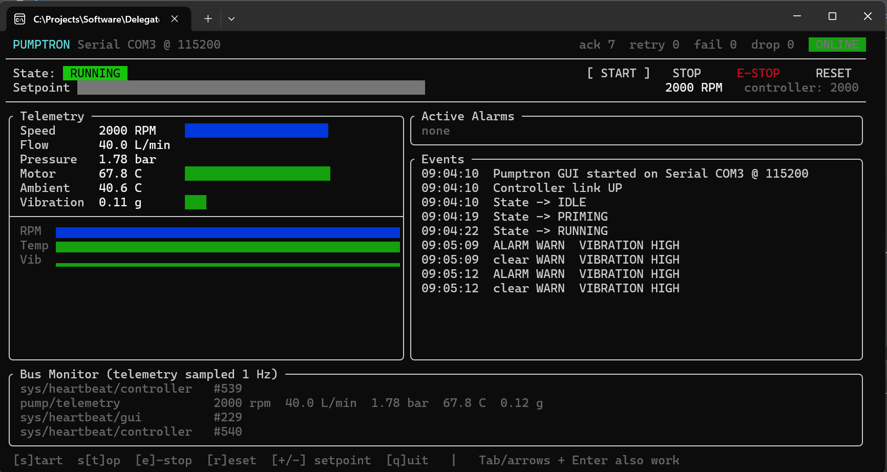
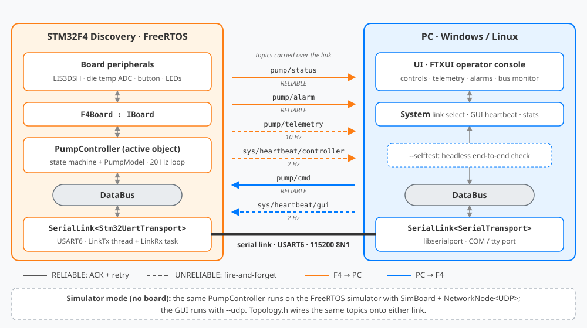

# Pumptron — Pump Controller on Real Hardware

**Pumptron** is a two-CPU DelegateMQ demo: an **STM32F4 Discovery** board runs a simulated industrial pump controller on FreeRTOS, and a **Windows/Linux** operator console (FTXUI) monitors and commands it over a **serial link** (USART6: a 3.3 V USB-UART adapter, or RS-232 via a base board). Both sides communicate only through the **DataBus**.

It is Cellutron's hardware sibling. Cellutron simulates three CPUs on one PC; Pumptron runs the controller on a real microcontroller. The exact same controller code also runs on the FreeRTOS simulator over UDP, so you can develop without the board.



*Operator console connected to the STM32F4 board over COM3: the pump running at 2000 RPM, live sparklines, alarm events from shaking the board, and the bus monitor.*

---

## What It Does

The F4 runs a centrifugal pump + motor model driven by a state machine:

```
IDLE --START--> PRIMING --(3 s)--> RUNNING
PRIMING/RUNNING --STOP or GUI link lost--> STOPPING --(stopped)--> IDLE
any --E-STOP / board button / over-temp / vibration trip--> FAULT (latched)
FAULT --RESET (stopped, cooled, button released)--> IDLE
```

| Signal | Source on the F4 | Source on the simulator |
|:---|:---|:---|
| Speed, flow, pressure, motor temperature | Pump model | Pump model |
| Ambient temperature | **MCU die temperature sensor** (ADC1) | Fixed 25 °C |
| Vibration | Model + **LIS3DSH accelerometer** (shake the board!) | Model only |
| Local E-STOP | **Blue USER button** | — |
| Status indicators | **LD3–LD6 LEDs** | Console prints |

Demo scenarios built into the model:

- **Shake the board** while running → vibration warning, then a `VIBRATION TRIP` fault if sustained for 300 ms.
- **Run at 3000 RPM** for about a minute → motor temperature climbs past 70 °C (warning), then trips `OVER-TEMP` at 85 °C. `RESET` is refused until it cools below 60 °C.
- **Sweep through ~2200 RPM** → a mild structural resonance is visible in the vibration trace.
- **Press the blue button** → local E-STOP.
- **Unplug the serial cable** while running → the controller loses the GUI heartbeat and safe-stops the pump (`GUI LINK LOST`), and the GUI shows `OFFLINE`. Plug it back in and both sides resync automatically.

LEDs:

| LED | Meaning |
|:---|:---|
| **Orange** solid / blinking | Powered / link degraded (`LINK_DEGRADED`: delivery failures, dropped frames or a retry backlog in the last 10 s) |
| **Green** | Priming or running |
| **Blue** | Toggles on every telemetry frame |
| **Red** solid | Pump fault latched, or a startup/FreeRTOS error (heap, stack overflow, `configASSERT`) |
| **Red** fast blink (~5 Hz) | DelegateMQ fault (`DMQ_ASSERT`), board halted; details on SWV |
| **Red** slow blink (~1 Hz) | Thread watchdog expired, board halted; thread name on SWV |

---

## Architecture



| Topic | Direction | Reliability | Purpose |
|:---|:---|:---|:---|
| `pump/cmd` | GUI → F4 | RELIABLE (ACK + retry) | START / STOP / ESTOP / RESET / SET_SPEED / QUERY |
| `pump/status` | F4 → GUI | RELIABLE | State, latched fault, setpoint (on change and on QUERY) |
| `pump/alarm` | F4 → GUI | RELIABLE | Alarm raised / cleared |
| `pump/telemetry` | F4 → GUI | UNRELIABLE, 10 Hz | RPM, flow, pressure, temperatures, vibration |
| `sys/heartbeat/controller` | F4 → GUI | UNRELIABLE, 2 Hz | GUI `OFFLINE` detection (`DeadlineSubscription`) |
| `sys/heartbeat/gui` | GUI → F4 | UNRELIABLE, 2 Hz | Safe-stop when the operator disappears |

All of this wiring lives in one place, [`common/util/Topology.h`](common/util/Topology.h). It is written as templates, so the same functions configure the serial link (hardware) and the UDP `NetworkNode` (simulator).

### DelegateMQ Features Shown

- **Location transparency.** `PumpController` and `UI` only call `DataBus::Publish/Subscribe`. Neither knows whether the other end is across a serial link, UDP, or absent.
- **DataBus over a serial link.** [`common/util/SerialLink.h`](common/util/SerialLink.h) is a point-to-point counterpart to `NetworkNode`. It has the same `Send<T>()`/`Receive<T>()` API and status signals, with RELIABLE and UNRELIABLE tiers sharing one UART.
- **Active objects.** Every handler (commands, 20 Hz control tick, heartbeat, link-loss deadline) is marshalled onto the pump thread, so the state machine needs no locks.
- **`DeadlineSubscription` heartbeats**, in both directions.
- **Every error channel is handled.** DataBus errors and unhandled topics, link delivery failures, retry backlogs and send-queue drops are all connected (`controller/pump/LinkErrorReporter.h`, `gui/system/System.cpp`).
  - On the controller they raise a `LINK_DEGRADED` warning alarm, and a failed status/alarm delivery triggers a rate-limited resync.
  - On the GUI they appear in the Events pane, e.g. "command NOT delivered".
  - The self-test fails if any of them fire during a normal run.
- **Explicit queue policies.** The link send thread uses `DROP`: a stalled cable drops frames instead of faulting the node, and drops are counted and shown in the GUI header. The pump thread uses `FAULT`, and the UI thread uses `DROP`.
- **Embedded-friendly build.** Static task stacks, a 64 KB FreeRTOS `heap_4` in CCM RAM, `DMQ_ALLOCATOR` fixed-block allocation, `DMQ_ASSERTS`, and no exceptions. The build uses about 333 KB of flash and 41 KB of SRAM.
- **Off-target development.** The controller's application code (`pump/`, `board/IBoard.h`, `common/`) is identical on the F4 and on the FreeRTOS simulator. Only `platform/f4/` or `platform/sim/` differs.

---

## Why DelegateMQ

What this project would need without it, and what DelegateMQ replaces:

| Concern | Hand-written | With DelegateMQ |
|:---|:---|:---|
| Message protocol | Type enum, packed structs, `switch` decoder, kept byte-compatible on both sides by hand | Typed topics + registered serializers |
| Framing, CRC | UART byte state machine | Built into the transports |
| Reliability | Seq numbers, ACKs, retry timers, give-up path | `Reliability::RELIABLE` in `Topology.h` |
| Cross-task handoff | Queue-item unions, `xQueueSend`/`switch` per task | `MakeDelegate(obj, &Fn, thread)` |
| State machine locking | Mutexes around shared state | None: every handler runs on the pump thread |
| Link supervision | Timestamps checked in loops | `DeadlineSubscription` |
| Off-target development | Separate UDP code path, or develop on hardware only | Same controller code runs on the PC FreeRTOS simulator; only the link and board in `main.cpp` change |
| Testing | Hardware in the loop, or custom test harnesses | `--selftest` drives the real controller over DataBus. The same test runs against the simulator (no board) and the F4 (over serial) |
| Bus inspection | Custom logging | `DataBus::Monitor` → GUI bus monitor |

**Net effect:** application code is domain logic only. Link choice, direction and reliability of every topic live in about 20 lines (`Topology.h`). Adding a subscriber costs one line, not a protocol change.

---

## Directory Layout

```
pumptron/
├── CMakeLists.txt            Desktop build: gui + controller (FreeRTOS simulator)
├── common/                   Shared by every node
│   ├── messages/             PumpCommand/PumpStatus/Telemetry/Alarm/Heartbeat messages
│   └── util/                 Constants, Serializers, SerialLink, Topology
├── controller/
│   ├── board/IBoard.h        Hardware abstraction used by the pump application
│   ├── pump/                 PumpController (state machine) + PumpModel (physics)
│   ├── platform/sim/         FreeRTOS simulator main + SimBoard (UDP link)
│   └── platform/f4/          STM32F4 firmware: main, F4Board, HAL/FreeRTOS config,
│                             startup, linker script, toolchain file, CMakeLists.txt
└── gui/
    ├── system/               Link selection (serial or UDP), heartbeat, link stats
    ├── ui/                   FTXUI operator console
    └── selftest/             Headless end-to-end test (--selftest)
```

---

## Building

Prerequisites: the DelegateMQ workspace with `FreeRTOS`, `ftxui` and `libserialport` fetched next to `DelegateMQ` (`python3 01_fetch_repos.py`).

### Desktop: GUI + Simulated Controller

From `example/pumptron`:

```bash
cmake -B build .
cmake --build build --config Release
```

Output: `build/bin/<config>/pumptron_gui` and `pumptron_controller`. On Windows, the top-level project forces a Win32 build because the FreeRTOS Windows simulator port is 32-bit only. For that reason libserialport is compiled from source into the GUI build.

### STM32F4 Firmware

Needs `arm-none-eabi-gcc`, Ninja, and the STM32Cube **FW_F4** package (HAL, CMSIS, Discovery BSP), which STM32CubeIDE/CubeMX install to `~/STM32Cube/Repository/`.

From `example/pumptron`:

```bash
cmake -S controller/platform/f4 -B build/f4 -G Ninja -DCMAKE_BUILD_TYPE=Debug
cmake --build build/f4
```

Output: `build/f4/pumptron_f4.elf`, `.hex`, `.bin`, `.map`.

Options:

| Variable | Default | Purpose |
|:---|:---|:---|
| `STM32_REPO` | `~/STM32Cube/Repository/STM32Cube_FW_F4_V1.28.3` | STM32Cube FW_F4 package |
| `ARM_TOOLCHAIN_DIR` | STM32CubeIDE's bundled GCC if found, else `PATH` | Directory containing `arm-none-eabi-gcc` |
| `CMAKE_BUILD_TYPE` | `Debug` (`-Og -g3`) | `Release` = `-Os -g` |

The toolchain file prefers STM32CubeIDE's own "GNU Tools for STM32" GCC, so command-line builds use the same compiler as the IDE.

### Flashing and Debugging

Any of these work with the `.elf`:

- **STM32CubeIDE:** *File → Import → C/C++ → STM32 Cortex-M Executable*, select `build/f4/pumptron_f4.elf`, then Debug. To see `printf` output, enable SWV (core clock **168 MHz**) and open the *SWV ITM Data Console* on port 0.
- **STM32CubeProgrammer:** `STM32_Programmer_CLI -c port=SWD -w build/f4/pumptron_f4.elf -v -rst`
- **OpenOCD:** `openocd -f board/stm32f4discovery.cfg -c "program build/f4/pumptron_f4.elf verify reset exit"`

---

## Running

### `run_pumptron.py`

```bash
python run_pumptron.py                         # simulation: controller + GUI, each in its own terminal
python run_pumptron.py --serial COM5           # hardware: GUI only, talking to the flashed board
python run_pumptron.py --selftest              # simulation, headless end-to-end check
python run_pumptron.py --serial COM5 --selftest
```

Options: `--baud <rate>` (default 115200) and `--config Debug|Release` (default Debug).

### Hardware

**What you need**

| Item | Notes |
|:---|:---|
| **STM32F407G-DISC1** Discovery kit | ST's current order code (Active); replaces the original STM32F4DISCOVERY. Both work: the BSP detects the LIS3DSH or older LIS302DL accelerometer at startup. |
| **3.3 V USB-UART adapter** (recommended) | Any FTDI, CP2102 or CH340 type adapter with 3.3 V logic levels. |
| *or* **STM32F4DIS-BB** base board + null-modem cable | Provides an RS-232 DB9 on USART6. Discontinued (Embest/element14); only use it if you already have one. |
| Mini-USB cable | Power plus the on-board ST-LINK for flashing and debugging. |

**Wiring (USB-UART adapter)**

| Adapter | Discovery board |
|:---|:---|
| TX | **PC7** (USART6 RX) |
| RX | **PC6** (USART6 TX) |
| GND | **GND** |

Cross TX to RX, leave the adapter's VCC unconnected (the board is powered over mini-USB), and **never** connect true RS-232 voltage levels directly to the pins. With the base board instead, mount the Discovery on it and connect its DB9 to the PC with a null-modem cable. Either way the link is 115200 8N1 and appears on the PC as a COM or tty port, so no firmware or GUI changes are needed.

**Run**

1. Flash `pumptron_f4.elf` (see *Flashing and Debugging*). The orange LED turns on and the blue LED starts blinking.
2. Run `python run_pumptron.py --serial <port>`, or start the GUI directly:
   ```bash
   pumptron_gui --serial COM5          # Windows
   pumptron_gui --serial /dev/ttyUSB0  # Linux
   ```
   Run `pumptron_gui` with no arguments to list the serial ports it can see. On Linux, `--serial` needs libserialport (`libserialport-dev`, or a build in the workspace's `libserialport/`); without it the GUI builds UDP-only.
3. Optionally check the link first with `python run_pumptron.py --serial <port> --selftest`.

### Simulator (No Board)

Run `python run_pumptron.py`, or start `pumptron_controller` and `pumptron_gui --udp` in separate terminals.

> **Known issue: the FreeRTOS Windows simulator's clock is unreliable.** The Win32 port simulates the tick with `Sleep(1)` and suspends task threads with `SuspendThread`, and the controller's tasks make real Windows calls (UDP sockets, console output), which the FreeRTOS Win32 port documents as unsafe. Measured effects:
> - In good runs, simulated time runs at a steady **~0.5× real time**. Priming, ramps and heartbeats look about 2× slower than on the board.
> - In some runs, in both Debug and Release, the simulated tick slows to **~0.1× or nearly stops**. Run-time stats from one stalled run pointed at the timer-daemon task. The pump then appears stuck in PRIMING and the self-test fails.
>
> The root cause has not been found yet. If a simulator run looks frozen, restart the controller. Console output is serialized through a FreeRTOS mutex (`controller/util/Logger.h`, the same approach as Cellutron); that removed one stall but not all of them. The STM32F4 hardware target does not use this port.

### Controls

| Key | Action |
|:---|:---|
| `s` / `t` | START / STOP |
| `e` | E-STOP |
| `r` | RESET a latched fault |
| `+` / `-` | Setpoint ±100 RPM (or drag the slider) |
| `q` / `Esc` | Quit |

The on-screen buttons can also be used with Tab/arrow keys and Enter, or with the mouse.

### Self-Test

`--selftest` replaces the UI with a scripted operator. It drives start, speed changes, stop, E-STOP and reset, and simulates a lost GUI heartbeat, then verifies every status, telemetry and alarm reply. It exits 0 on success.

```bash
python run_pumptron.py --selftest                 # simulator
python run_pumptron.py --serial COM5 --selftest   # real board
```

It measures the controller's clock against wall time first and scales its timeouts to match, so a steady half-speed simulator still passes. It fails if the simulator clock stalls (see the known issue above). On the STM32F4 board over the serial link it passes every step, with the controller clock at 1.00× real time and no retries.

---

## Porting Notes

- **New board.** Implement `board::IBoard` and write a `platform/<board>/main.cpp` that creates the link and calls `ConfigureControllerLink()`. Nothing in `pump/` or `common/` changes.
- **New link.** Any type with NetworkNode-style `Send<T>()`/`Receive<T>()` works with `Topology.h`.
- **UART error recovery.** `Stm32UartTransport` does not restart interrupt-driven reception after a UART error (overrun, framing, noise). `platform/f4/main.cpp` re-arms it from `HAL_UART_ErrorCallback()`. The frame CRC rejects any frame corrupted by the error.
